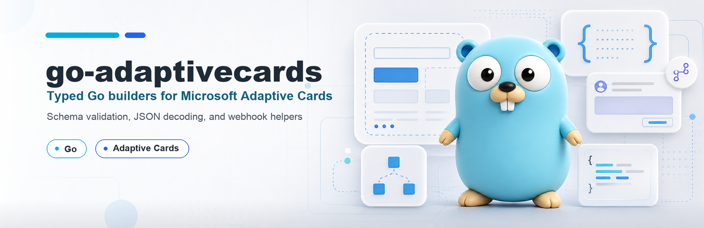

# go-adaptivecards

[](https://pkg.go.dev/github.com/untcha/go-adaptivecards)
[](go.mod)
[](LICENSE)

Experimental Go library for building and validating Microsoft [Adaptive Cards](https://adaptivecards.io/).

## Important Status

**This project is experimental and not production-ready.**

- API and behavior can change without notice.
- Breaking changes are expected.
- The implementation is **not** at 100% Microsoft Adaptive Cards feature parity.
- Use with caution, especially in production systems.

## Scope

This repository provides:

- Strongly typed Go models for selected Adaptive Card features
- Builder-style APIs for composing cards
- Logical validation and JSON Schema validation support against [schema version 1.5.0](https://adaptivecards.io/schemas/1.5.0/adaptive-card.json)
- JSON factory-based decoding for interface fields (`Element`, `Action`)
- Optional, SSRF-hardened webhook posting helper for Teams/workflow endpoints
- Microsoft Teams `msteams` host extension support (for example full-width cards)

## Requirements

- Go 1.25 or newer (see [`go.mod`](go.mod))

## Install

```bash
go get github.com/untcha/go-adaptivecards
```

Full API documentation is available on
[pkg.go.dev](https://pkg.go.dev/github.com/untcha/go-adaptivecards).

## Quick Example

Quick "Hello, World!" example (from `examples/simple/main.go`):

```go
package main

import (
	"context"
	"fmt"
	"os"

	"github.com/untcha/go-adaptivecards/adaptivecards/card"
	"github.com/untcha/go-adaptivecards/adaptivecards/elements"
	"github.com/untcha/go-adaptivecards/adaptivecards/webhook"
)

func main() {
	// Webhook URL
	url := os.Getenv("TEAMS_TEST_WORKFLOW_URL")

	textblock := elements.NewTextBlock("Hello, World!")

	card, err := card.NewCard().
		AddElement(textblock).
		Build()

	if err != nil {
		panic(err)
	}

	// Validate runs logical checks and validates against the embedded
	// Adaptive Cards JSON Schema before the card is sent or serialized.
	if err := card.Validate(); err != nil {
		panic(err)
	}

	json, _ := card.MarshalJSON()
	fmt.Println(string(json))

	// Post to Teams webhook if URL is provided
	if url != "" {
		if err := webhook.PostToWorkflowRaw(context.Background(), url, card); err != nil {
			panic(err)
		}
	}
}
```

## Examples

Runnable examples live under [`examples/`](examples/):

- [`examples/simple`](examples/simple/main.go) — minimal "Hello, World!" card.
- [`examples/simple_table`](examples/simple_table/main.go) — a `Table` with
  columns, header row, styling, and an action.
- [`examples/full_width`](examples/full_width/main.go) — a full-width card using
  the Teams `msteams` host extension.

Each example optionally posts to a Teams workflow when the
`TEAMS_TEST_WORKFLOW_URL` environment variable is set.

## Feature Matrix (Current State)

Legend:

- `[x]` Type/feature exists in this repo
- `[ ]` Not implemented yet
- Checked items can still be partial vs full official schema behavior

### AdaptiveCard Root

- [x] `AdaptiveCard`
- [x] `body`
- [x] `actions`
- [x] `selectAction`
- [x] `backgroundImage`
- [x] `minHeight`
- [x] `rtl`
- [x] `lang`
- [x] `speak`
- [x] `fallbackText`
- [x] `verticalContentAlignment`
- [ ] `refresh` (placeholder only)
- [ ] `authentication` (placeholder only)
- [ ] `metadata` (placeholder only)

### Actions

- [x] `Action.OpenUrl`
- [x] `Action.Submit`
- [x] `Action.ToggleVisibility`
- [ ] `Action.ShowCard`
- [ ] `Action.Execute`

### Elements

- [x] `TextBlock`
- [x] `RichTextBlock`
- [x] `TextRun`
- [x] `Image`
- [ ] `Media`

### Containers

- [x] `Container`
- [x] `Column`
- [x] `ColumnSet`
- [x] `ActionSet`
- [x] `FactSet`
- [x] `ImageSet`
- [x] `Table` (including `TableRow`, `TableCell`, `TableColumnDefinition`)

### Inputs

- [x] `Input.Text`
- [x] `Input.Number`
- [x] `Input.Date`
- [x] `Input.Time`
- [x] `Input.ChoiceSet`
- [x] `Input.Toggle`

### Host Extensions

- [x] Microsoft Teams `msteams` (full-width via `Card.SetFullWidth`, `Card.SetMSTeams`)

### Tooling / Validation

- [x] Logical validation methods on card/types
- [x] JSON factory decode for action/element interfaces
- [x] Embedded Adaptive Card schema validation support
- [x] Webhook helper (`webhook.PostToWorkflowRaw`) with SSRF-hardened URL policy

## Package Layout

- `adaptivecards/card`: AdaptiveCard root model and card-level builders/validation
- `adaptivecards/actions`: action types and action factory
- `adaptivecards/elements`: leaf elements and element validation
- `adaptivecards/containers`: container-style elements, including Table
- `adaptivecards/inputs`: input elements and validation
- `adaptivecards/core/model`: shared enums, value objects, low-level validation
- `adaptivecards/core/element`: element interfaces, fallback model, element factory
- `adaptivecards/schema`: schema validation integration
- `adaptivecards/webhook`: helpers to send card JSON to webhook endpoints

## Sending to a Webhook

`webhook.PostToWorkflowRaw` validates the card and posts it as the entire
request body to a workflow/webhook endpoint:

```go
err := webhook.PostToWorkflowRaw(ctx, workflowURL, card)
```

Outbound requests are guarded by a `URLPolicy` that is strict by default to
reduce SSRF risk: HTTPS only, private/loopback/link-local targets blocked, and
an optional exact-hostname allowlist. Use
`webhook.PostToWorkflowRawWithClientAndPolicy` to supply a custom
`*http.Client` and/or relax the policy.

## Development

Common commands:

```bash
task test
task lint
task check
task project:update:schema
```

The root `Taskfile.yml` includes the shared Go-library tasks from
`taskfiles/common.yml` (flattened, so they run unprefixed, e.g. `task lint`).
Repo-specific tasks live in `taskfiles/Taskfile.project.yml` and are included
under the `project:` namespace (e.g. `task project:update:schema`).

## Changelog

Notable changes are documented in [CHANGELOG.md](CHANGELOG.md), following
[Keep a Changelog](https://keepachangelog.com/) and Semantic Versioning.

## License

This project is licensed under the MIT License - see the [LICENSE](LICENSE) file for details.
